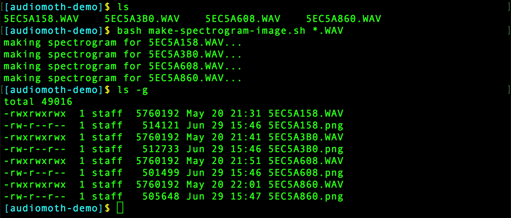
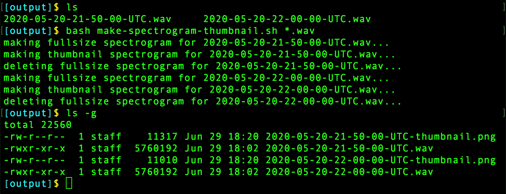

# audiomoth-scripts
A small collection of bash scripts for audio collected by the AudioMoth acoustic monitoring device.

## Background

The [AudioMoth](https://www.openacousticdevices.info/) is a small, programmable audio recorder designed for acoustic monitoring. I began developing these scripts to analyze and visualize the audio collected using an AudioMoth. I am not affiliated with [Open Acoustic Devices](https://www.openacousticdevices.info/home), producers of the AudioMoth.

## Requirements

These scripts require the following command line tools:

- [SoX](http://sox.sourceforge.net/) - "the Swiss Army knife of sound processing programs"
- [ImageMagick](https://imagemagick.org/) - "create, edit, compose, or convert bitmap images"
- [ffmpeg](https://ffmpeg.org/) - "solution to record, convert and stream audio and video"

## Basic Usage

These scripts are designed to work on files in batches, using syntax like the following:

```
bash rename-by-date.sh *.WAV
bash make-spectrogram-image.sh *.WAV
bash make-spectrogram-movie.sh *.wav
```

### 1. rename-by-date.sh

The first script in this collection provides AudioMoth recordings with a more helpful filenames based on the date and time they were captured. The original files are left unaltered and copies are made with their new filenames in a subdirectory named ```output```.


Additional details:

- To achieve this, it gets "birth time" from the ```stat``` command, which can have some [variations in syntax between operating systems](https://en.wikipedia.org/wiki/Stat_(system_call)). 
- Since the AudioMoth uses [UTC](https://en.wikipedia.org/wiki/Coordinated_Universal_Time), that time zone is preserved in the renaming. 

### 2. make-spectrogram-image.sh

This script is used to generate basic spectrogram images of AudioMoth recordings. It generates PNG images of the whole recording that are saved alongside the original WAV files with a same filename.



Additional details:

- To achieve this, the script uses [SoX](http://sox.sourceforge.net/), a cross-platform command line utility for audio operations. Make sure that SoX is installed and properly configured before using this script.
- The images generated will be 1280 by 720 pixels, although it looks like the script asks for 1136 by 642 pixels. This is because SoX adds some padding to the images for the graph axes and unit labels. Be aware that changing the size may require some experimenting to get the right dimensions.


### 3. make-spectrogram-thumbnail.sh

A variation on script number 2 that produces small thumbnail spectrograms that are useful for the web. It generates PNG images of the first 30 seconds that are saved alongside the original WAV files with a same filename.



Additional details:

- To achieve this, the script uses both [SoX](http://sox.sourceforge.net/) and [ImageMagick](https://imagemagick.org/). Make sure these tools are installed and properly configured before using this script.
- If a recording is shorter than 30 seconds, the whole file is used to generate the spectrogram.
- The script actually creates a full-size image first then resizes it to produce the 128 by 72 pixels thumbnail version. The full-size 1280 by 720 pixels version is then deleted to save space, but you could easily keep it by [commenting out these lines](https://github.com/nwolek/audiomoth-scripts/blob/master/make-spectrogram-thumbnail.sh#L42).

## Acknowledgements

My research into using the AudioMoth for acoustic ecology is supported by the following:

- Stetson University's [Institute for Water and Environmental Resilience](https://www.stetson.edu/other/iwer/)
