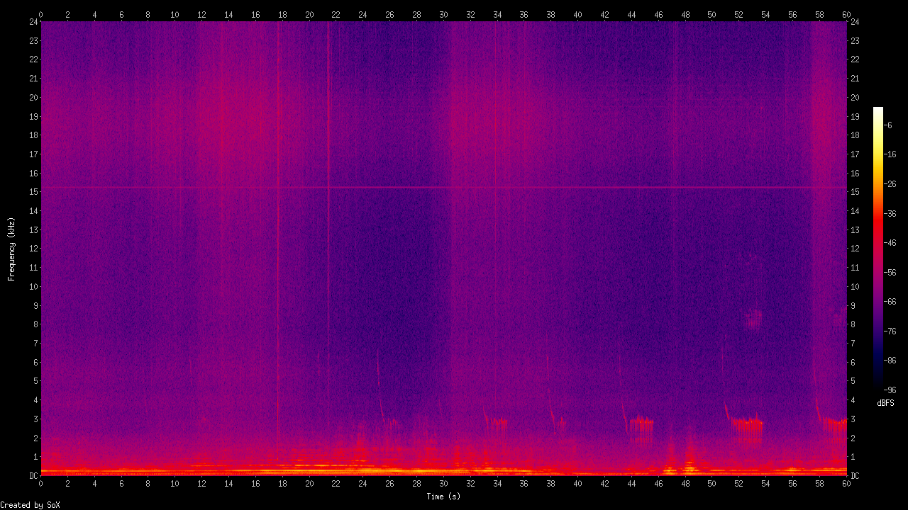
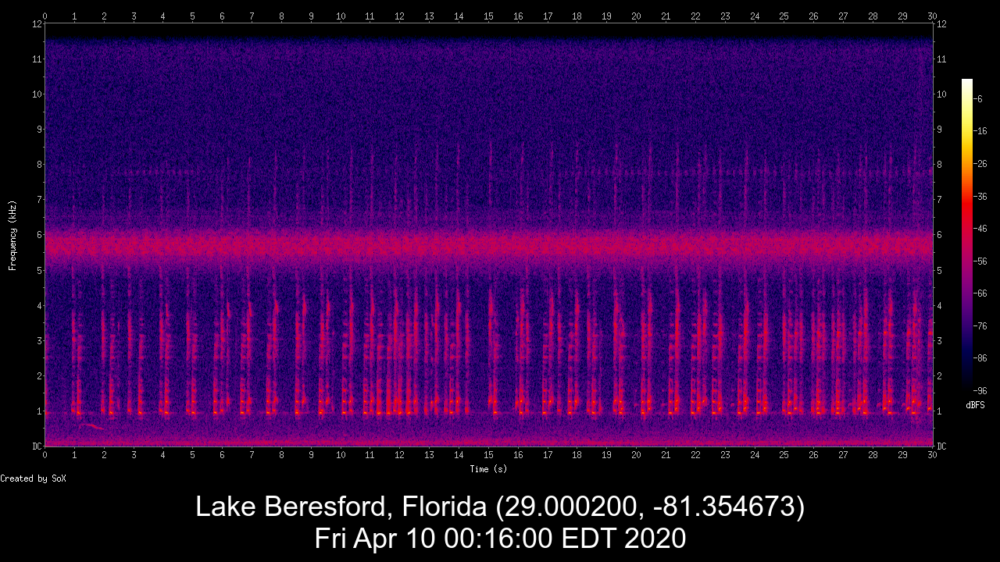
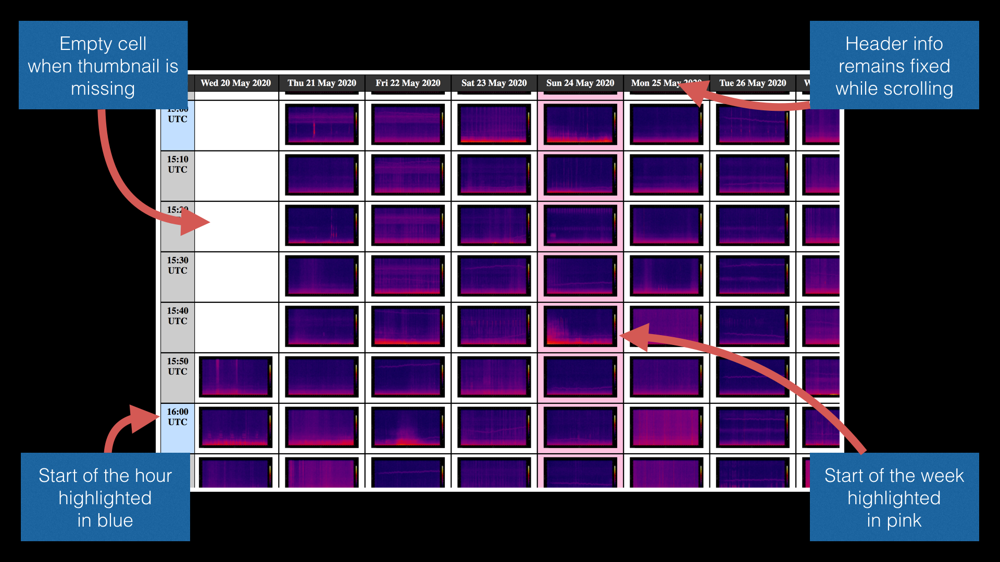
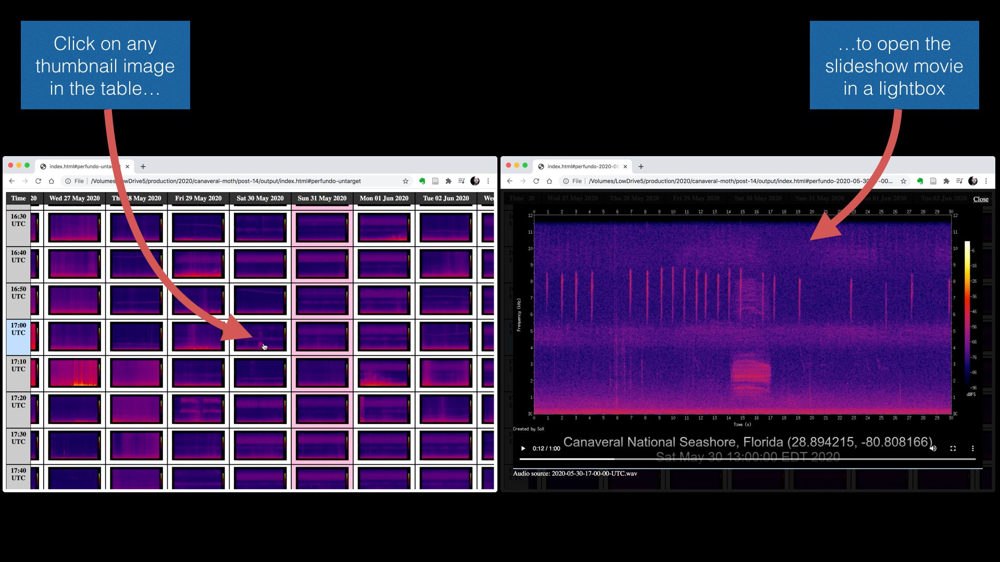

# audiomoth-scripts
**By Nathan Wolek - [@LowkeyNW](http://twitter.com/lowkeynw) - [http://nathanwolek.com](http://www.nathanwolek.com)**

A small collection of Bash scripts for audio collected by the AudioMoth acoustic monitoring device.

## Background

The [AudioMoth](https://www.openacousticdevices.info/) is a small, programmable audio recorder designed for acoustic monitoring. After deploying my AudioMoths for several weeks during Florida's COVID-19 Stay at Home order, I began developing these scripts to analyze, visualize, and share the audio I collected. I am not affiliated with [Open Acoustic Devices](https://www.openacousticdevices.info/home), producers of the AudioMoth. Any questions about the device itself should be directed to them.

I realize that many users of the AudioMoth may have minimal experience using the [Bash shell](https://en.wikipedia.org/wiki/Bash_(Unix_shell)). Therefore, I have done my best to clearly document the steps for using these scripts in hopes of encouraging more people in [acoustic ecology](https://en.wikipedia.org/wiki/Acoustic_ecology) and [bioacoustics](https://en.wikipedia.org/wiki/Bioacoustics) to explore this amazing tool for batch processing large collections of audio files. If you are looking for a good general resource for learning more about the Bash shell, I highly recommend [The Missing Semester](https://missing.csail.mit.edu/), a collection of lessons by 3 MIT grad students. 

## How to Install

These scripts require the following command line tools:

- [SoX](http://sox.sourceforge.net/) - "the Swiss Army knife of sound processing programs"
- [ImageMagick](https://imagemagick.org/) - "create, edit, compose, or convert bitmap images"
- [ffmpeg](https://ffmpeg.org/) - "solution to record, convert and stream audio and video"

If you are an *experienced shell user* who already has these tools installed and configured, you can easily add the AudioMoth scripts to your home folder using something like following commands:

```
cd ~/bin
git clone https://github.com/nwolek/audiomoth-scripts.git
echo -e "PATH=\"\$PATH\":\"~/bin/audiomoth-scripts\"" >> ~/.bash_profile
```

If you are an *occasional shell user* on the MacOS or Windows, you will have a few more steps. Microsoft has recently provided a [Terminal for Windows users](https://devblogs.microsoft.com/commandline/introducing-windows-terminal/), but I have no experience with it. MacOS users can access the shell via the built-in [Terminal application](https://support.apple.com/guide/terminal/open-or-quit-terminal-apd5265185d-f365-44cb-8b09-71a064a42125/mac), which is the method I use. I have checked the following steps on MacOS 10.14 Mojave.

Once you are in the terminal, I recommend [installing Homebrew](https://brew.sh/), which allows you to more easily add command line tools. If you go this route, you can have the required tools for the AudioMoth scripts installed by stepping through the following commands:

```
/bin/bash -c "$(curl -fsSL https://raw.githubusercontent.com/Homebrew/install/master/install.sh)"
brew install sox
brew install imagemagick
brew install ffmpeg
brew install git
```

After that, you can install the AudioMoth scripts in your home directory. It's good practice to keep your Bash scripts together in a folder called ```bin```. You can create that folder and download the AudioMoth scripts like this:

```
cd ~
mkdir bin
cd bin
git clone https://github.com/nwolek/audiomoth-scripts.git
```

Finally, you will want to add these scripts to your search path. This saves you from having to type the whole path every time you want to run the script. You can add the relevant folders to your search path using the following commands:

```
echo -e "PATH=\"\$PATH\":\"~/bin\"" >> ~/.bash_profile
echo -e "PATH=\"\$PATH\":\"~/bin/audiomoth-scripts\"" >> ~/.bash_profile
```

That should finish the installation!

## How to Use

These scripts are designed to work on files in batches, using syntax like the following:

```console
bash rename-by-date.sh *.WAV
bash make-spectrogram-image.sh 5EC5A*.WAV
bash make-spectrogram-movie.sh 2020-06-01-*.wav
```

### 1. rename-by-date.sh

The first script in this collection provides AudioMoth recordings with a more helpful filenames based on the date and time they were captured. The original files are left unaltered and copies are made with their new filenames in a subdirectory named ```output```.

Example:

```console
[audiomoth-demo]$ ls 
5EC5A158.WAV	5EC5A3B0.WAV	5EC5A608.WAV	5EC5A860.WAV
[audiomoth-demo]$ bash rename-by-date.sh *.WAV
[audiomoth-demo]$ cd output
[output]$ ls
2020-05-20-21-30-00-UTC.wav	2020-05-20-21-50-00-UTC.wav
2020-05-20-21-40-00-UTC.wav	2020-05-20-22-00-00-UTC.wav
[output]$
```

Additional details:

- To achieve this, it gets "birth time" from the ```stat``` command, which can have some [variations in syntax between operating systems](https://en.wikipedia.org/wiki/Stat_(system_call)). 
- Since the AudioMoth uses [UTC](https://en.wikipedia.org/wiki/Coordinated_Universal_Time), that time zone is preserved in the renaming. 

### 2. make-spectrogram-image.sh

This script is used to generate basic spectrogram images of AudioMoth recordings. It generates PNG images of the whole recording that are saved alongside the original WAV files with a same filename.

Example:

```console
[audiomoth-demo]$ ls
5EC5A158.WAV	5EC5A3B0.WAV	5EC5A608.WAV	5EC5A860.WAV
[audiomoth-demo]$ bash make-spectrogram-image.sh *.WAV
making spectrogram for 5EC5A158.WAV...
making spectrogram for 5EC5A3B0.WAV...
making spectrogram for 5EC5A608.WAV...
making spectrogram for 5EC5A860.WAV...
[audiomoth-demo]$ ls -g
total 49208
-rwxrwxrwx  1 staff  5760192 May 20 21:31 5EC5A158.WAV
-rw-r--r--  1 staff   539916 Jun 30 16:42 5EC5A158.png
-rwxrwxrwx  1 staff  5760192 May 20 21:41 5EC5A3B0.WAV
-rw-r--r--  1 staff   538542 Jun 30 16:42 5EC5A3B0.png
-rwxrwxrwx  1 staff  5760192 May 20 21:51 5EC5A608.WAV
-rw-r--r--  1 staff   526156 Jun 30 16:42 5EC5A608.png
-rwxrwxrwx  1 staff  5760192 May 20 22:01 5EC5A860.WAV
-rw-r--r--  1 staff   532306 Jun 30 16:42 5EC5A860.png
[audiomoth-demo]$ 
```

Additional details:

- To achieve this, the script uses [SoX](http://sox.sourceforge.net/), a cross-platform command line utility for audio operations. Make sure that SoX is installed and properly configured before using this script.
- The images generated will be 1280 by 720 pixels, although it looks like the script asks for 1136 by 642 pixels. This is because SoX adds some padding to the images for the graph axes and unit labels. Be aware that changing the size may require some experimenting to get the right dimensions.

Output:



### 3. make-spectrogram-thumbnail.sh

A variation on script number 2 that produces small thumbnail spectrograms that are useful for the web. It generates PNG images of the first 30 seconds that are saved alongside the original WAV files with a same filename.

Example:

```console
[output]$ ls
2020-05-20-21-50-00-UTC.wav	2020-05-20-22-00-00-UTC.wav
[output]$ bash make-spectrogram-thumbnail.sh *.wav
making fullsize spectrogram for 2020-05-20-21-50-00-UTC.wav...
making thumbnail spectrogram for 2020-05-20-21-50-00-UTC.wav...
deleting fullsize spectrogram for 2020-05-20-21-50-00-UTC.wav...
making fullsize spectrogram for 2020-05-20-22-00-00-UTC.wav...
making thumbnail spectrogram for 2020-05-20-22-00-00-UTC.wav...
deleting fullsize spectrogram for 2020-05-20-22-00-00-UTC.wav...
[output]$ ls -g
total 22560
-rw-r--r--  1 staff    11317 Jun 29 18:20 2020-05-20-21-50-00-UTC-thumbnail.png
-rwxr-xr-x  1 staff  5760192 Jun 29 18:02 2020-05-20-21-50-00-UTC.wav
-rw-r--r--  1 staff    11010 Jun 29 18:20 2020-05-20-22-00-00-UTC-thumbnail.png
-rwxr-xr-x  1 staff  5760192 Jun 29 18:02 2020-05-20-22-00-00-UTC.wav
[output]$ 
```

Additional details:

- To achieve this, the script uses both [SoX](http://sox.sourceforge.net/) and [ImageMagick](https://imagemagick.org/). Make sure these tools are installed and properly configured before using this script.
- If a recording is shorter than 30 seconds, the whole file is used to generate the spectrogram.
- The script actually creates a full-size image first then resizes it to produce the 128 by 72 pixels thumbnail version. The full-size 1280 by 720 pixels version is then deleted to save space, but you could easily keep it by [commenting out these lines](https://github.com/nwolek/audiomoth-scripts/blob/master/make-spectrogram-thumbnail.sh#L42).

### 4. make-spectrogram-movie.sh

This script creates a spectrogram slideshow and pairs it with the original audio to produce an MP4 movie file. Each slide visualizes 30 seconds of sound and displays information about when and where the audio was captured.

Example:

```console
[output]$ bash make-spectrogram-movie.sh 2020-05-20-22-*.wav

Starting movie for 2020-05-20-22-00-00-UTC.wav...
making spectrogram from 0 to 30 seconds...
making spectrogram from 30 to 60 seconds...
creating full length movie...
[output]$ ls -g
total 21824
-rw-r--r--  1 staff  1176220 Jun 30 17:51 2020-05-20-22-00-00-UTC-slide0.png
-rw-r--r--  1 staff  1160476 Jun 30 17:51 2020-05-20-22-00-00-UTC-slide1.png
-rw-r--r--  1 staff  1115565 Jun 30 17:51 2020-05-20-22-00-00-UTC.mp4
-rwxr-xr-x  1 staff  5760192 Jun 30 17:35 2020-05-20-22-00-00-UTC.wav
[output]$ 
```

Additional details:

- To achieve this, the script uses both [SoX](http://sox.sourceforge.net/), [ImageMagick](https://imagemagick.org/) and [ffmpeg](https://ffmpeg.org/). Make sure these tools are installed and properly configured before using this script.
- This script expects the filenames that are output from ```rename-by-date.sh```, so make sure you run that script first. The date and time of recording for the text on each slide is actually taken from the filename.
- Information about the recording location is set by [these two variables at the top](https://github.com/nwolek/audiomoth-scripts/blob/master/make-spectrogram-movie.sh#L21) of the bash script. 

Output:



[View movie on YouTube.](https://www.youtube.com/watch?v=BkSST3gdyWI)

### 5. make-html-table.sh

This script is used to create an HTML interface for reviewing spectrograms in a collection of AudioMoth recordings. It does this by generating an ```index.html``` file that contains a table of thumbnail images organized with dates in columns and times in rows. 

Example:

```console
[output]$ find *.wav | wc -l # how many wav files?
    2297
[output]$ bash make-html-table.sh *.wav
[output]$ open index.html
[output]$ 
```

Additional details:

- This script expects the filenames from ```rename-by-date.sh``` and thumbnails from ```make-spectrogram-thumbnail.sh```, so make sure you run those scripts first. The dates and times used for constructing the table are actually taken from the filenames, so this script will not work on the unaltered AudioMoth recordings.
- Several formatting features of the HTML table depend on [the ```spectrogram-table.css``` file included in this repo](https://github.com/nwolek/audiomoth-scripts/blob/master/spectrogram-table.css). It was adapted from [this CodePen example by Paul O'Brien](https://codepen.io/paulobrien/pen/LBrMxa).

Output:



### 6. make-html-lightbox-table.sh

A variation on script number 5 that adds the ability to click through thumbnails to access the slideshow movies generated by script 4. The MP4 movies are displayed in a lightbox overlay on top of the HTML table to provide a unified interface for browsing material gathered by the AudioMoth.

Example:

```console
[output]$ find *.wav | wc -l # how many wav files?
    2297
[output]$ bash make-html-lightbox-table.sh *.wav
[output]$ open index.html
[output]$ 
```

Additional details:

- Since this is really a variation of ```make-html-table.sh```, be advised that all of the notes in that section of the README apply this script too. 
- This script makes use of materials generated by several other scripts in the collection, so make sure you run these scripts first:
	- ```rename-by-date.sh```
	- ```make-spectrogram-thumbnail.sh```
	- ```make-spectrogram-movie.sh```
- The lightbox effect is enabled by another CSS file, [the ```perfundo.min.css``` file included in this repo](https://github.com/nwolek/audiomoth-scripts/blob/master/spectrogram-table.css). It was copied from [this GitHub repo by Markus Oberlehner](https://github.com/maoberlehner/perfundo). 

Output:



[View movie on Twitter.](https://twitter.com/LowkeyNW/status/1275570344171048961)

## Acknowledgements

My research into using the AudioMoth for acoustic ecology is supported by the following:

- Stetson University's [Institute for Water and Environmental Resilience](https://www.stetson.edu/other/iwer/)
